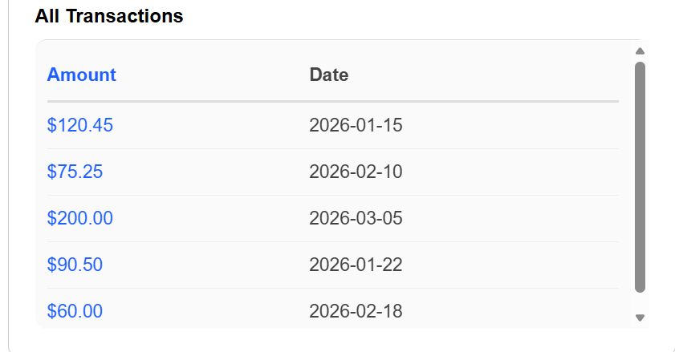
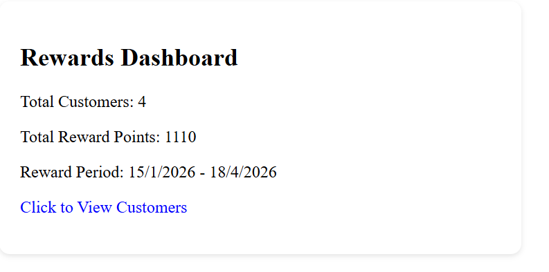
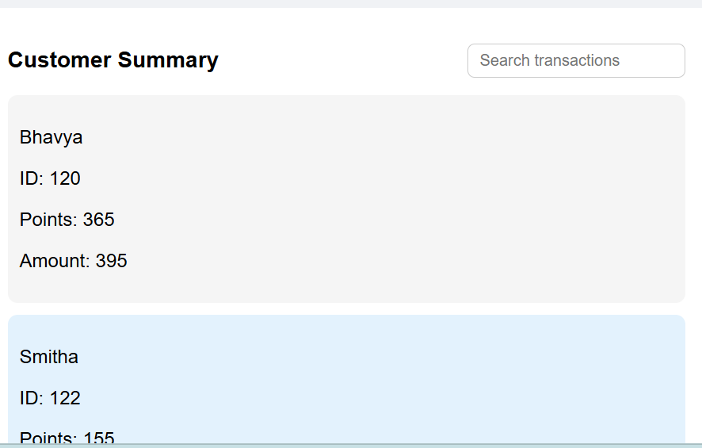
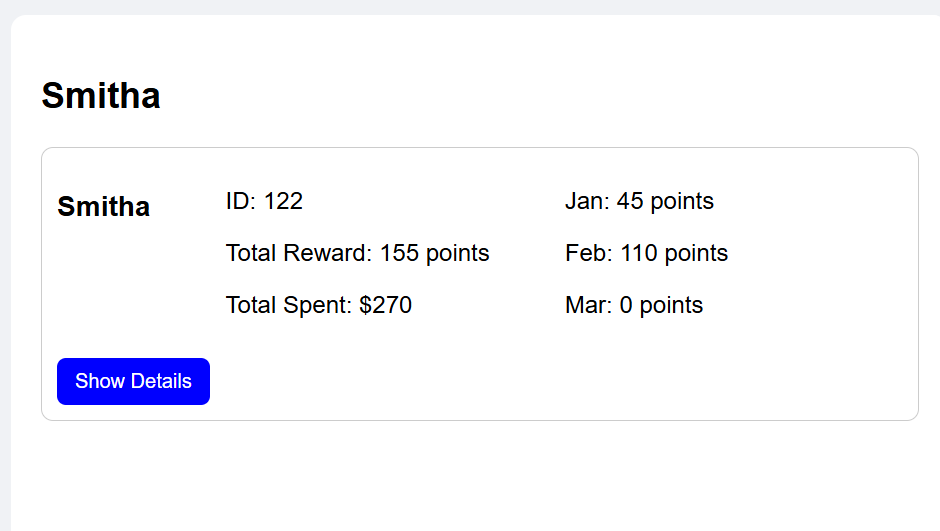
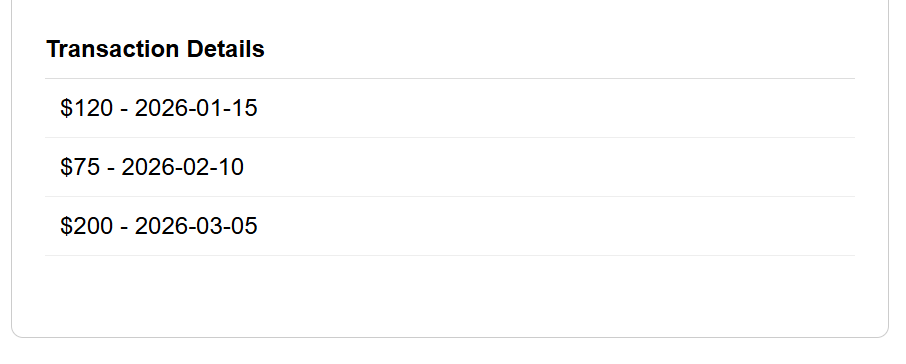

#Scrollable List Rewards Dashboard

A small React application that displays customer reward points and transaction details.

#Project Structure

#DashboardPage.js - Main dashboard view. Loads transactions from the API service. Aggregates customers and reward points.Toggles customer summary and passes selected customer data to detail views.

#CustomerPage.js - Renders selected customer details.Accepts customer props from the dashboard or route parameters.Keeps customer detail rendering separate from dashboard summary logic.

#CustomerDetails.js - Shows total points, monthly breakdown, customer ID, and transaction details. Includes a simple toggle to show/hide the transaction list.

#Rewards.js - Contains reward calculation logic. Aggregates customer totals, monthly points, and transaction arrays.Ensures customer ID and total amount are preserved per customer.

#useRewards.js - Custom React hook that memoizes reward aggregation for a transaction list. Wraps totalPrice and returns customer reward summaries for dashboard and customer views.

#transactionData.js - Static transaction data used by the app. Includes 'customerID', 'customerName', 'amount', and 'date'.

#Api.js -  Simulates async loading of transaction data with a promise.

#Run the app

Install dependencies:

npm install

Start the app locally:

npm start

#to make tests run
npx react-scripts test --watchAll=false

#TestsPassed

#DashboardPage

#customaer page

#customer Details

#Transaction List view
